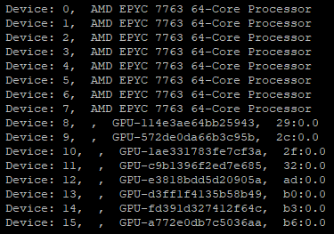
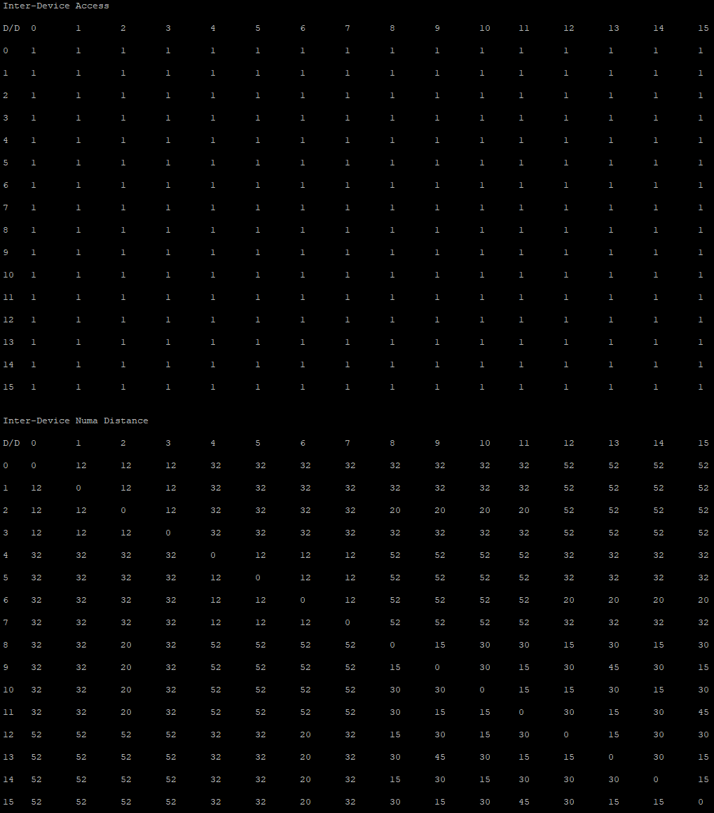
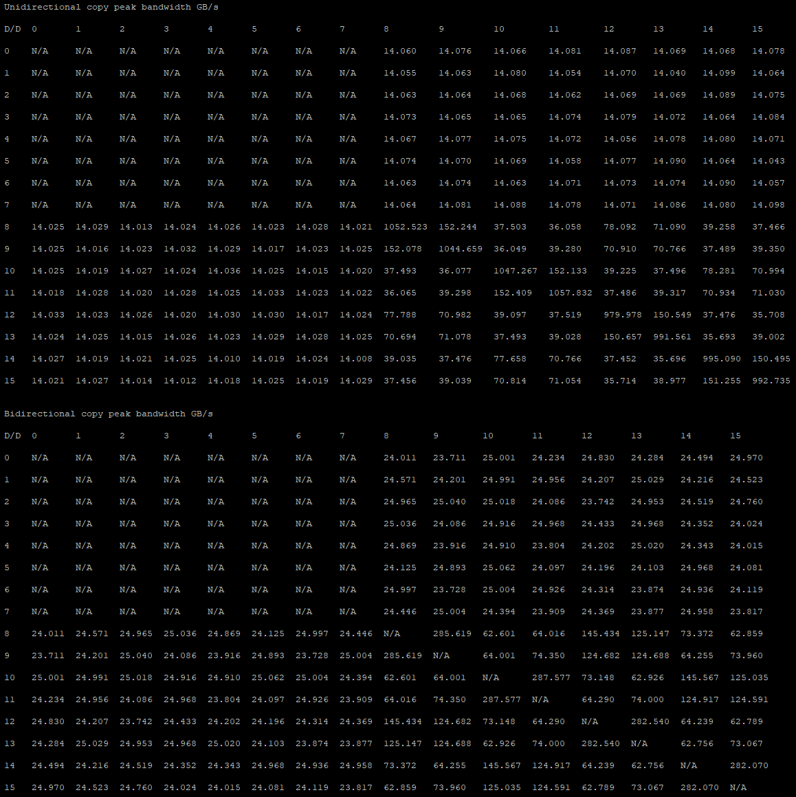

<head>
  <meta charset="UTF-8">
  <meta name="description" content="MI200 high-performance computing and tuning guide">
  <meta name="keywords" content="MI200, high-performance computing, HPC, tuning, BIOS
  settings, NBIO">
</head>

# MI200 high-performance computing and tuning guide

## System settings

This chapter reviews system settings that are required to configure the system
for AMD Instinct MI250 accelerators and improve the performance of the GPUs. It
is advised to configure the system for the best possible host configuration
according to the *High Performance Computing (HPC) Tuning Guide for AMD EPYC
7003 Series Processors*.

Configure the system BIOS settings as explained in {ref}`mi200-bios-settings` and
enact the below given settings via the command line as explained in
{ref}`mi200-os-settings`:

* Core C states
* input-output memory management unit (IOMMU), if needed

(mi200-bios-settings)=

### System BIOS settings

For maximum MI250 GPU performance on systems with AMD EPYC™ 7003-series
processors (codename "Milan") and AMI System BIOS, the following configuration
of system BIOS settings has been validated. These settings must be used for the
qualification process and should be set as default values for the system BIOS.
Analogous settings for other non-AMI System BIOS providers could be set
similarly. For systems with Intel processors, some settings may not apply or be
available as listed in the following table.

```{list-table}
:header-rows: 1
:name: mi200-bios

*
  - BIOS Setting Location
  - Parameter
  - Value
  - Comments
*
  - Advanced / PCI Subsystem Settings
  - Above 4G Decoding
  - Enabled
  - GPU Large BAR Support
*
  - Advanced / PCI Subsystem Settings
  - SR-IOV Support
  - Disabled
  - Disable Single Root IO Virtualization
*
  - AMD CBS / CPU Common Options
  - Global C-state Control
  - Auto
  - Global C-States
*
  - AMD CBS / CPU Common Options
  - CCD/Core/Thread Enablement
  - Accept
  - Global C-States
*
  - AMD CBS / CPU Common Options / Performance
  - SMT Control
  - Disable
  - Global C-States
*
  - AMD CBS / DF Common Options / Memory Addressing
  - NUMA nodes per socket
  - NPS 1,2,4
  - NUMA Nodes (NPS)
*
  - AMD CBS / DF Common Options / Memory Addressing
  - Memory interleaving
  - Auto
  - Numa Nodes (NPS)
*
  - AMD CBS / DF Common Options / Link
  - 4-link xGMI max speed
  - 18 Gbps
  - Set AMD CPU xGMI speed to highest rate supported
*
  - AMD CBS / NBIO Common Options
  - IOMMU
  - Disable
  -
*
  - AMD CBS / NBIO Common Options
  - PCIe Ten Bit Tag Support
  - Auto
  -
*
  - AMD CBS / NBIO Common Options
  - Preferred IO
  - Bus
  -
*
  - AMD CBS / NBIO Common Options
  - Preferred IO Bus
  - "Use lspci to find pci device id"
  -
*
  - AMD CBS / NBIO Common Options
  - Enhanced Preferred IO Mode
  - Enable
  -
*
  - AMD CBS / NBIO Common Options / SMU Common Options
  - Determinism Control
  - Manual
  -
*
  - AMD CBS / NBIO Common Options / SMU Common Options
  - Determinism Slider
  - Power
  -
*
  - AMD CBS / NBIO Common Options / SMU Common Options
  - cTDP Control
  - Manual
  - Set cTDP to the maximum supported by the installed CPU
*
  - AMD CBS / NBIO Common Options / SMU Common Options
  - cTDP
  - 280
  -
*
  - AMD CBS / NBIO Common Options / SMU Common Options
  - Package Power Limit Control
  - Manual
  - Set Package Power Limit to the maximum supported by the installed CPU
*
  - AMD CBS / NBIO Common Options / SMU Common Options
  - Package Power Limit
  - 280
  -
*
  - AMD CBS / NBIO Common Options / SMU Common Options
  - xGMI Link Width Control
  - Manual
  - Set AMD CPU xGMI width to 16 bits
*
  - AMD CBS / NBIO Common Options / SMU Common Options
  - xGMI Force Link Width
  - 2
  -
*
  - AMD CBS / NBIO Common Options / SMU Common Options
  - xGMI Force Link Width Control
  - Force
  -
*
  - AMD CBS / NBIO Common Options / SMU Common Options
  - APBDIS
  - 1
  -
*
  - AMD CBS / NBIO Common Options / SMU Common Options
  - DF C-states
  - Enabled
  -
*
  - AMD CBS / NBIO Common Options / SMU Common Options
  - Fixed SOC P-state
  - P0
  -
*
  - AMD CBS / UMC Common Options / DDR4 Common Options
  - Enforce POR
  - Accept
  -
*
  - AMD CBS / UMC Common Options / DDR4 Common Options / Enforce POR
  - Overclock
  - Enabled
  -
*
  - AMD CBS / UMC Common Options / DDR4 Common Options / Enforce POR
  - Memory Clock Speed
  - 1600 MHz
  - Set to max Memory Speed, if using 3200 MHz DIMMs
*
  - AMD CBS / UMC Common Options / DDR4 Common Options / DRAM Controller
    Configuration / DRAM Power Options
  - Power Down Enable
  - Disabled
  - RAM Power Down
*
  - AMD CBS / Security
  - TSME
  - Disabled
  - Memory Encryption
```

#### NBIO link clock frequency

The NBIOs (4x per AMD EPYC™ processor) are the serializers/deserializers (also
known as "SerDes") that convert and prepare the I/O signals for the processor's
128 external I/O interface lanes (32 per NBIO).

LCLK (short for link clock frequency) controls the link speed of the internal
bus that connects the NBIO silicon with the data fabric. All data between the
processor and its PCIe lanes flow to the data fabric based on these LCLK
frequency settings. The link clock frequency of the NBIO components need to be
forced to the maximum frequency for optimal PCIe performance.

For AMD EPYC™ 7003 series processors, configuring all NBIOs to be in "Enhanced
Preferred I/O" mode is sufficient to enable highest link clock frequency for the
NBIO components.

#### Memory configuration

For setting the memory addressing modes, especially
the number of NUMA nodes per socket/processor (NPS), follow the guidance of the
"High Performance Computing (HPC) Tuning Guide for AMD EPYC 7003 Series
Processors" to provide the optimal configuration for host side computation. For
most HPC workloads, NPS=4 is the recommended value.

(mi200-os-settings)=

### Operating system settings

#### CPU core states - C-states

There are several core states (C-states) that an AMD EPYC CPU can idle within:

* C0: active. This is the active state while running an application.
* C1: idle
* C2: idle and power gated. This is a deeper sleep state and will have a
       greater latency when moving back to the C0 state, compared to when the
       CPU is coming out of C1.

Disabling C2 is important for running with a high performance, low-latency
network. To disable power-gating on all cores run the following on Linux
systems:

```shell
cpupower idle-set -d 2
```

Note that the `cpupower` tool must be installed, as it is not part of the base
packages of most Linux® distributions. The package needed varies with the
respective Linux distribution.

::::{tab-set}
:::{tab-item} Ubuntu
:sync: ubuntu

```shell
sudo apt install linux-tools-common
```

:::

:::{tab-item} Red Hat Enterprise Linux
:sync: RHEL

```shell
sudo yum install cpupowerutils
```

:::

:::{tab-item} SUSE Linux Enterprise Server
:sync: SLES

```shell
sudo zypper install cpupower
```

:::
::::

#### AMD-IOPM-UTIL

This section applies to AMD EPYC™ 7002 processors to optimize advanced
Dynamic Power Management (DPM) in the I/O logic (see NBIO description above)
for performance. Certain I/O workloads may benefit from disabling this power
management. This utility disables DPM for all PCI-e root complexes in the
system and locks the logic into the highest performance operational mode.

Disabling I/O DPM will reduce the latency and/or improve the throughput of
low-bandwidth messages for PCI-e InfiniBand NICs and GPUs. Other workloads
with low-bandwidth bursty PCI-e I/O characteristics may benefit as well if
multiple such PCI-e devices are installed in the system.

The actions of the utility do not persist across reboots. There is no need to
change any existing firmware settings when using this utility. The "Preferred
I/O" and "Enhanced Preferred I/O" settings should remain unchanged at enabled.

```{tip}
The recommended method to use the utility is either to create a system
start-up script, for example, a one-shot `systemd` service unit, or run the
utility when starting up a job scheduler on the system. The installer
packages (see
[Power Management Utility](https://developer.amd.com/iopm-utility/)) will
create and enable a `systemd` service unit for you. This service unit is
configured to run in one-shot mode. This means that even when the service
unit runs as expected, the status of the service unit will show inactive.
This is the expected behavior when the utility runs normally. If the service
unit shows failed, the utility did not run as expected. The output in either
case can be shown with the `systemctl status` command.

Stopping the service unit has no effect since the utility does not leave
anything running. To undo the effects of the utility, disable the service
unit with the `systemctl disable` command and reboot the system.

The utility does not have any command-line options, and it must be run with
super-user permissions.
```

#### Systems with 256 CPU threads - IOMMU configuration

For systems that have 256 logical CPU cores or more (e.g., 64-core AMD EPYC™
7763 in a dual-socket configuration and SMT enabled), setting the input-output
memory management unit (IOMMU) configuration to "disabled" can limit the number
of available logical cores to 255. The reason is that the Linux® kernel disables
X2APIC in this case and falls back to Advanced Programmable Interrupt Controller
(APIC), which can only enumerate a maximum of 255 (logical) cores.

If SMT is enabled by setting "CCD/Core/Thread Enablement > SMT Control" to
"enable", the following steps can be applied to the system to enable all
(logical) cores of the system:

* In the server BIOS, set IOMMU to "Enabled".
* When configuring the Grub boot loader, add the following arguments for the
  Linux kernel: `amd_iommu=on iommu=pt`
* Update Grub to use the modified configuration:

  ```shell
  sudo grub2-mkconfig -o /boot/grub2/grub.cfg
  ```

* Reboot the system.
* Verify IOMMU passthrough mode by inspecting the kernel log via `dmesg`:

  ```none
  [...]
  [   0.000000] Kernel command line: [...] amd_iommu=on iommu=pt
     [...]
  ```

Once the system is properly configured, ROCm software can be
installed.

## System management

For a complete guide on how to install/manage/uninstall ROCm on Linux, refer to
{doc}`Quick-start (Linux)<rocm-install-on-linux:tutorial/quick-start>`. For verifying that the
installation was successful, refer to the
{doc}`post-install instructions<rocm-install-on-linux:how-to/native-install/post-install>` and
[Validation Tools](../../reference/library-index.md). Should verification
fail, consult the [System Debugging Guide](../system-debugging.md).

(mi200-hw-verification)=

### Hardware verification with ROCm

The AMD ROCm™ platform ships with tools to query the system structure. To query
the GPU hardware, the `rocm-smi` command is available. It can show available
GPUs in the system with their device ID and their respective firmware (or VBIOS)
versions:


To see the system structure, the localization of the GPUs in the system, and the
fabric connections between the system components, use:


* The first block of the output shows the distance between the GPUs similar to
  what the `numactl` command outputs for the NUMA domains of a system. The
  weight is a qualitative measure for the "distance" data must travel to reach
  one GPU from another one. While the values do not carry a special (physical)
  meaning, the higher the value the more hops are needed to reach the
  destination from the source GPU.
* The second block has a matrix named "Hops between two GPUs", where 1 means the
  two GPUs are directly connected with XGMI, 2 means both GPUs are linked to the
  same CPU socket and GPU communications will go through the CPU, and 3 means
  both GPUs are linked to different CPU sockets so communications will go
  through both CPU sockets. This number is one for all GPUs in this case since
  they are all connected to each other through the Infinity Fabric links.
* The third block outputs the link types between the GPUs. This can either be
  "XGMI" for AMD Infinity Fabric links or "PCIE" for PCIe Gen4 links.
* The fourth block reveals the localization of a GPU with respect to the NUMA
  organization of the shared memory of the AMD EPYC processors.

To query the compute capabilities of the GPU devices, use `rocminfo` command. It
lists specific details about the GPU devices, including but not limited to the
number of compute units, width of the SIMD pipelines, memory information, and
Instruction Set Architecture (ISA):


For a complete list of architecture (LLVM target) names, refer to GPU OS Support for
{doc}`Linux<rocm-install-on-linux:reference/system-requirements>` and
{doc}`Windows<rocm-install-on-windows:reference/system-requirements>`.

### Testing inter-device bandwidth

{ref}`mi100-hw-verification` showed the `rocm-smi --showtopo` command to show
how the system structure and how the GPUs are located and connected in this
structure. For more details, the `rocm-bandwidth-test` can run benchmarks to
show the effective link bandwidth between the components of the system.

The ROCm Bandwidth Test program can be installed with the following
package-manager commands:

::::{tab-set}
:::{tab-item} Ubuntu
:sync: ubuntu

```shell
sudo apt install rocm-bandwidth-test
```

:::

:::{tab-item} Red Hat Enterprise Linux
:sync: RHEL

```shell
sudo yum install rocm-bandwidth-test
```

:::

:::{tab-item} SUSE Linux Enterprise Server
:sync: SLES

```shell
sudo zypper install rocm-bandwidth-test
```

:::
::::

Alternatively, the source code can be downloaded and built from
[source](https://github.com/RadeonOpenCompute/rocm_bandwidth_test).

The output will list the available compute devices (CPUs and GPUs), including
their device ID and PCIe ID:



The output will also show a matrix that contains a "1" if a device can
communicate to another device (CPU and GPU) of the system and it will show the
NUMA distance (similar to `rocm-smi`):



The output also contains the measured bandwidth for unidirectional and
bidirectional transfers between the devices (CPU and GPU):


