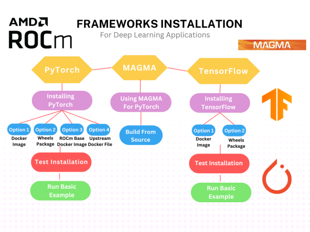

# Magma Installation for ROCm

Pull content from
<https://docs.amd.com/bundle/ROCm-Deep-Learning-Guide-v5.4.1/page/Frameworks_Installation.html>

The following sections cover the different framework installations for ROCm and
Deep Learning applications. Figure 5 provides the sequential flow for the use of
each framework. Refer to the ROCm Compatible Frameworks Release Notes for each
framework's most current release notes at
/bundle/ROCm-Compatible-Frameworks-Release-Notes/page/Framework_Release_Notes.html.
<!---  ---> 

## PyTorch
PyTorch is an open source Machine Learning Python library, primarily differentiated by Tensor computing with GPU acceleration and a type-based automatic differentiation. Other advanced features include:
- Support for distributed training
- Native ONNX support
- C++ frontend
- The ability to deploy at scale using TorchServe
- A production-ready deployment mechanism through TorchScript
### Installing PyTorch
To install ROCm on bare metal, refer to the section [ROCm Installation](https://docs.amd.com/bundle/ROCm-Deep-Learning-Guide-v5.4-/page/Prerequisites.html#d2999e60). The recommended option to get a PyTorch environment is through Docker. However, installing the PyTorch wheels package on bare metal is also supported.